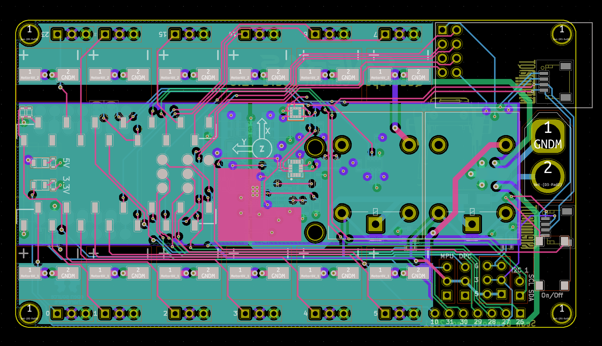
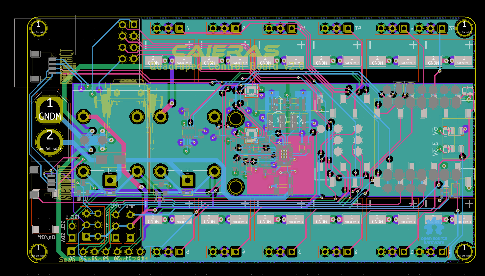
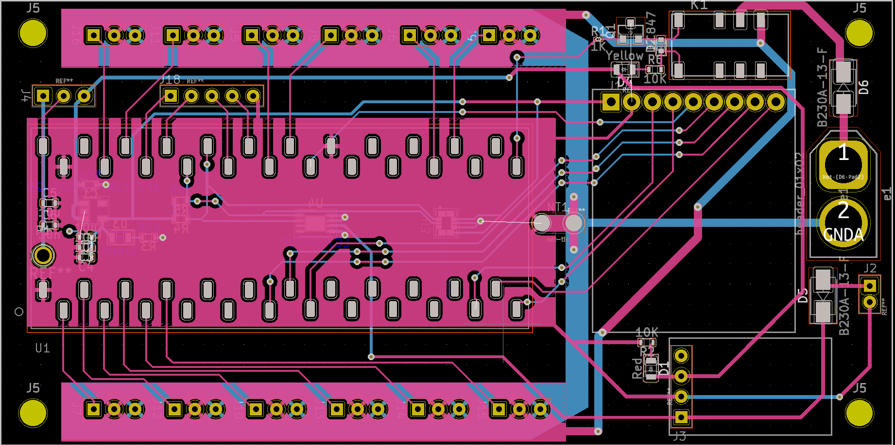

Ever since I started working on my quadruped, I knew that I wanted to make a 'motherboard' pcb for it. [Version 1](https://seanboe.github.io/blog/quadruped7), a two layer board, came equiped with some great features: 

<ul class="list-disc pl-5 pt-3 pb-3">
  <li><a href="https://www.mouser.com/datasheet/2/308/1/LC709203F_D-2315014.pdf" class="text-green-500">LC709203F</a> battery guage sensor (Coulomb Counter)</li>
  <li><a href="https://www.st.com/resource/en/datasheet/lsm6dsox.pdf" class="text-green-500">LSM6DSOX</a> interial measurement unit</li>  
  <li>Controlled by a teensy 4.1</li>
  <li>LoRa radio - 900Mhz</li>
  <li>6 Breakout GPIO, includign an I2C bus and associated power/ground lines</li>
  <li>Automatic power shutoff (a relay)</li>
</ul>

### There were some problems, however:
<ul class="list-disc pl-5 pt-3 pb-3">
  <li>Motor port header pins 1mm too small 😭</li>
  <li>Internal timer conflict between the pwm servo library and the radio library resulted in communication + motor failtures</li>
  <li>Underspeced relay, which eventually broke... three times.</li>
  <li>Seperate 1-cell lipo required for 5V boost power, so two batteries required in total 🤮</li>
  <li>Didn't use all pins on teensy 4.1, which was a waste</li>
</ul>

### Caieras
I now introduce the __new control board__, which I've affectionately named _Caieras_. It includes better everything:

<ul class="list-disc pl-5 pt-3 pb-3">
  <li><a href="https://www.st.com/resource/en/datasheet/lsm303agr.pdf" class="text-green-500">LSM303AGR</a> accelerometer + magnetometer (I'm only using magnetometer)</li>  
  <li><a href="https://www.st.com/resource/en/datasheet/lsm6dsox.pdf" class="text-green-500">LSM6DSOX</a> gyroscope + accelerometer (the same one)</li>  
  <li>Controlled by a teensy 4.0 to save space</li>
  <li>On/off button</li>
  <li>samd21 coprocessor for running sensorfusion algorithms</li>
  <li>nrf24Lo1 for simplicity and to save space (it is almost 2x smaller than the previous LoRa)</li>
  <li>15 teensy and 9 coprocessor breakout GPIO, including an two I2C buses and associated power/ground lines</li>
  <li>2 StemmaQT/quicc connectors for easy sensor additions</li>
  <li>Dual power shutoff relays each rated for 10A</li>
  <li>One battery required; <a href="https://www.analog.com/media/en/technical-documentation/data-sheets/lt8653s.pdf" class="text-green-500">LT8653S</a> dual-channel step-down regulator handles convertion from 7V to 3.3V and 5V</li>
  <li>Support for an addition of adafruit's <a href="https://www.adafruit.com/product/4646" class="text-green-500">BNO055 breakout</a>. This chip would be integrated into the pcb, but they were out of stock everywhere</li>
  <li><a href="https://www.bosch-sensortec.com/media/boschsensortec/downloads/product_flyer/bst-bme280-fl000.pdf" class="text-green-500">BME280</a> thermometer, barometer, and humidity sensor (for fun)</li>  
  <li>New decoupling capacitors for greater motor voltage stability</li>
  <li>plated mounting holes</li>
</ul>

##### More specs:

<ul class="list-disc pl-5 pt-3 pb-3">
  <li>147 vias</li>
  <li>357 pads</li>
  <li>809 Track Segments</li>
  <li>353 Nodes</li>
</ul>

### Pictures:

#### Front:

#### Back:

#### In comparison, V1...

Many of the improvements I've made are meant to fix the failures on version 1. First, I've implemented a new radio whose library doesn't result in a timer collision and messes stuff up. Previously, when using the LoRa radio, the motors would become jittery. I've also added a magnetometer to the board this time for accurate sensor fusion. Previously, I didn't know that a magnetometer was required for accurate inertial measurement (smh) which resulted in inaccurate measurements... which is bad. While I originally wanted to use the BNO055/BNO080, they were out of stock, so made a compromise and added a place to install the breakout board and stemmaqt interface ports on the board. I also added the new power regulator chip to save board space, as well as to avoid having to use more than one battery, which was very annoying for version 1. The new relays are meant to withstand the motor currents and _not_ break this time. maybe the best improvement is that of a coprocessor, however, which will simplify/speed up the sensor fusion. On version 1, walking gaits were difficult to manage due to the clock cycles used simply to read sensor values and to calculate the PID controller (plus the inverse kinematics engine on top of that). With the samd21 running at 48Mhz, this process should be sped up a bit. Finally, I fixed the dumb stuff like the poorly sized header holes and the sharp corners. Overall, I'm very excited for the new board!